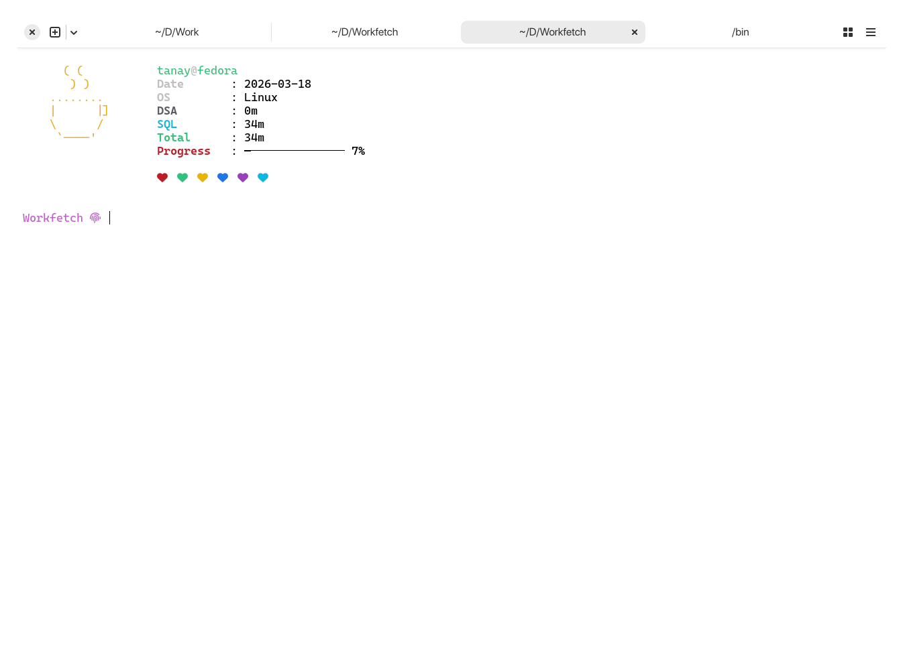

# WorkFetch



A minimalist, `neofetch`-inspired dashboard for tracking daily work hours. Perfect for developers working on long-term projects like **DSA** or **SQL** who want a visual progress bar every time they open their terminal.

## Features

- **Progress Bar:** Visual representation of your daily goal (8h default).
- **Project Breakdown:** Automatically filters and sums hours by project name.
- **Dynamic Icons:** Choose between hearts, ghosts, or solid blocks.
- **Randomized ASCII Art:** Switches between a rabbit and a coffee mug on launch.

## Setup

1. **Clone the repo:**
   ```bash
   git clone git@github.com:tanaybhomia/workfetch.git
   cd workfetch
   sudo mv workfetch /usr/bin/
   cd /usr/bin/
   chmod +x workfetch.sh
   ```
2. **Add your Favourite Projects**
   ```bash
   workfetch Project Project
   ```

## PSA
Works only with the work script that you can find here to track your projects 
[Work](https://github.com/tanaybhomia/Work)
